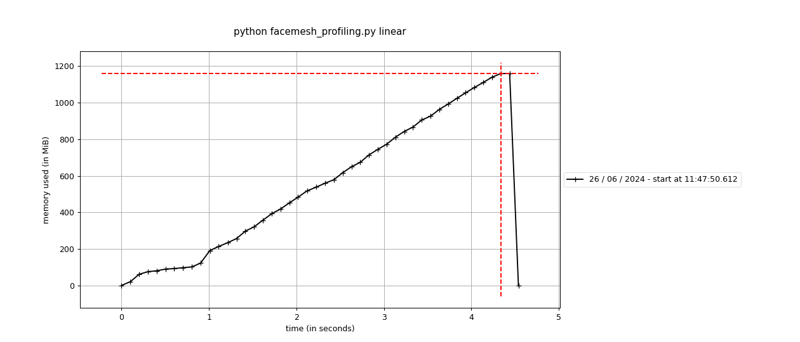
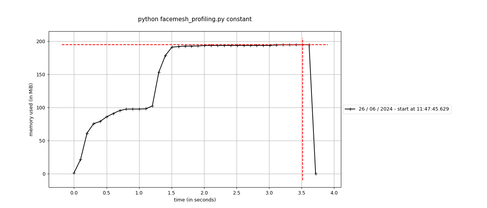

# memory-profiler

When processing large datasets it is important to use memory with maximum efficiency. Or you can get out of RAM, job will not be done and machine can become unresponsive.

### Example of memory usage investigation

Our task is to apply face mesh on each image from a dataset. For face mesh we will use google's mediapipe package. 

*First example is creating an instance of a very complex object FaceMesh() on each iteration.*

*Second example is creating and closes an instance of a very complex object FaceMesh() on each iteration.*

*Third example once creates an instance of a very complex object FaceMesh() and reuses it on each iteration.*

## To run memory profiling benchmarks
Install required packages with `pip install -r requirements.txt`

Have a `./images` directory with images.

Check and run `profiling.sh`
